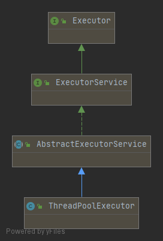

# 执行器

从 Java 5 开始，Java 并发 API 便引入了执行器框架，用以改善那些执行大量并发任务的并发应用程序的性能。

## 执行器简介

### 执行器的基本特征

- 不需要创建 Thread 对象。如果要执行一个并发任务，只需要创建一个执行该任务（例如一个实现 Runnable 接口的类）的实例并且将其发送给执行器。执行器会管理执行该任务的线程。

- 执行器通过重新使用线程来缩减线程创建带来的开销。在内部，执行器管理着一个线程池，其中的线程称为工作线程（worker-thread）。如果向执行器发送任务而且存在某一空闲的工作线程，那么执行器就会使用该线程执行任务。
- 使用执行器控制资源很容易。可以限制执行器工作线程的最大数目。如果发送的任务数多于工作线程数，那么执行器就会将任务存入一个队列。当工作线程完成某个任务的执行后，将从队列中调取另一个任务继续执行。
- 必须以显式方式结束执行器的执行，必须告诉执行器完成执行之后终止所创建的线程。否则，执行器则不会结束执行，这样应用程序也不会结束。

### 执行器框架的基本组件

- **Executor 接口**

  Executor 框架的基本接口。它仅定义了一个方法，即允许编程人员向执行器发送一个 Runnable 对象。

- **ExecutorService 接口**

  扩展了 Executor 接口并且包括更多方法，增加了该框架的功能。

  - 执行可返回结果的任务：Runnable 接口提供的 `run()` 方法并不会返回结果，但是借用执行器，任务可以返回结果。
  - 通过单个方法调用执行一个任务列表。
  - 结束执行器的执行并且等待其终止。

- **ThreadPoolExecutor 类**

  实现了 Executor 接口和 ExecutorService 接口。此外，它还包含一些其他获取执行器状态（工作线程的数量、已执行任务的数量等）的方法、确定执行器参数（工作线程的最小和最大数目、空闲线程等待新任务的时间等）的方法，以及支持编程人员扩展和调整其功能的方法。

- **Executors 类**

  为创建 Executor 对象和其他相关类提供了实用方法。

## k-最近邻算法

k-最邻近算法是一种用于监督分类的简单机器学习算法。该算法的主要组成部分如下所示。

- 训练数据集：该数据集由实例构成，其中包括定义每个实例的一个或者多个属性，以及一个可确定实例标签的特殊属性。
- 距离指标：该指标用于确定训练数据集的实例与你想要分类的新实例之间的距离（或者说相似度）。
- 测试数据集：该数据集用于度量算法的行为。

对某个实例进行分类时，该算法计算该实例和训练数据集所有实例的距离。然后，选取 k 个距离最邻近的实例并且查看这些实例的标签。实例最多的标签将被指派为输入实例的标签。

### 串行版本

EuclideanDistanceCalculator 中提供 `calculate()` 方法用于计算两个范例的欧氏距离。

KnnClassifier 中实现计算、排序、统计，获取 。

### 并发版本

#### 细粒度并发版本

KnnClassifierParrallelIndividual 中存放了：训练数据集、参数 k、执行并行任务的 ThreadPoolExecutor 对象，以及一个用于指定是否要进行并行排序的属性。

IndividualDistanceTask 中将输入范例与训练数据集中某个范例之间的距离作为一项并发任务计算。

---

首先，为每个需要计算的距离创建一个任务，并且将其发送给执行器，然后主线程等待这些任务执行结束。

**CountDownLatch** 类允许一个线程一直等待，直到其他线程到达其代码的某一确定点。

- `getDown()`

  该方法用于减少要等待的线程数。

- `await()`

  该方法挂起调用它的线程，直到计数器达到 0 为止。

用执行器中执行的任务数初始化 CountDownLatch 类。主线程为其调用 `await()` 方法，而每个任务完成其计算时调用 `getDown()` 方法.

#### 粗粒度并发版本

启动 numThreads 个任务， 并且将训练数据集划分为 numThreads 个组。

### ★ 小结

以可用核心数作为线程数，创建一个线程数固定的执行器。

以可用核心数分组，创建 Task，在执行器中执行。

通过 CountDownLatch 实现所有任务都执行后，再继续主线程中的任务。

最后关闭执行器。

